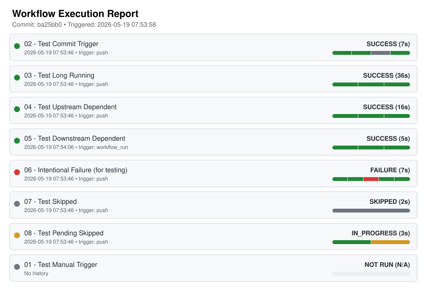

# GitHub Actions Centralized Telemetry Observer

<!-- telemetry-svg-start -->

<!-- telemetry-svg-end -->

This repository implements a Centralized Workflow Telemetry Collector (Observer) designed to securely monitor and measure all workflow activity tied to a specific Commit SHA, without interfering directly with the workloads being monitored.

Per the MVP design, this pattern removes the need to embed telemetry logic directly inside other workflow files. Instead, the centralized observer automatically initializes, discovers what is executing, waits for all executions to finish, and extracts their structural telemetry (including durations, job steps, and event metadata).

## Project Overview

### What the Project Does
The Telemetry Observer tracks all workflows triggered by a single event in your repository. It builds a detailed timeline of execution, identifying which workflows succeeded, failed, or were skipped, and records step-by-step durations. 

### Primary Use Cases
* **CI/CD Pipeline Analytics:** Monitor long-running or problematic workflows.
* **Audit and Compliance:** Keep historical records of exactly what executed for a given commit.
* **Dashboarding:** Export JSON metrics to an external API to build centralized dashboards.
* **Visual Reporting:** Generate an SVG timeline report directly inside your repository README.

### Architecture
* **Observer Trigger:** Triggered automatically via `push`, `pull_request`, and `workflow_dispatch`. It is also configured via `workflow_run` to capture manual triggers.
* **Identifier:** Bound strictly to `github.sha`.
* **Stabilization Engine:** Listens to GitHub Action API responses until the number of reported workflow runs matching the trigger SHA stabilizes. This accounts for asynchronous creation and polling latency.
* **Metrics Collector:** Harvests workflow run metadata, resolves internal job details, and attaches precise timestamps alongside Git commit history.

## Security Notes

Security and credential handling are prioritized in this action. 

* **Secret Masking:** Any external credentials provided to the action (such as `api_url` and `api_key`) are explicitly registered with GitHub Actions secret masking (`::add-mask::`). This ensures that if they are accidentally printed to stdout or logs, they will be redacted.
* **API Key Handling:** The `api_key` is securely passed as a Bearer token in the Authorization header to the configured `api_url`. It is never stored or written to disk.
* **Documentation Examples:** Any secrets or tokens shown in the documentation examples below are utilizing GitHub's variables (`${{ secrets.SECRET_NAME }}`) and are masked automatically by the runtime environment. No raw credentials should ever be hardcoded.

## Usage Guide

Because the core polling and visualization logic is wrapped inside a Composite Action, integrating this into any other GitHub repository requires minimal setup. There are two primary output methods.

### Method 1: JSON Only Output

The default behavior of the observer is to generate a comprehensive JSON payload. This is ideal for exporting metrics to an external system, a SIEM, or a custom dashboard.

**Use Cases:**
* API integration with external logging platforms.
* Storing raw structured data for historical analytics.

**Example Workflow Configuration:**

```yaml
name: Global Telemetry Observer

on:
  push:
  pull_request:

permissions:
  actions: read
  contents: read

jobs:
  telemetry:
    runs-on: ubuntu-latest
    steps:
      - name: Observer Telemetry Agent
        uses: HimanM/Github-Actions-Telemetry@main
        with:
          github_token: ${{ secrets.GITHUB_TOKEN }}
          api_url: ${{ secrets.TELEMETRY_API_URL }}
          api_key: ${{ secrets.TELEMETRY_API_KEY }}

      - name: Upload JSON Telemetry Data
        if: always()
        uses: actions/upload-artifact@v4
        with:
          name: telemetry-test-jsons
          path: ${{ steps.observer.outputs.json_path }}
```

**Expected Output Structure:**
The observer generates a JSON file at `test_jsons/main_{datetime}_{sha}.json`. The payload includes:
* `repository`, `telemetry_session`, `head_sha`
* `commit` metadata
* Detailed `workflows` array with step-by-step job information.

### Method 2: SVG + JSON Output

If you want a visual representation of your workflows alongside the data, you can enable SVG report generation. 

**Use Cases:**
* Displaying real-time CI status visually on the repository's `README.md`.
* Quick visual debugging of parallel workflows.

**Example Workflow Configuration:**

```yaml
name: Global Telemetry Observer

on:
  push:
  pull_request:

permissions:
  actions: read
  contents: write # Required to auto-commit the SVG

jobs:
  telemetry:
    runs-on: ubuntu-latest
    steps:
      - name: Observer Telemetry Agent
        id: observer
        uses: HimanM/Github-Actions-Telemetry@main
        with:
          github_token: ${{ secrets.GITHUB_TOKEN }}
          generate_svg_report: 'true'

      - name: Upload JSON Telemetry Data
        if: always()
        uses: actions/upload-artifact@v4
        with:
          name: telemetry-test-jsons
          path: ${{ steps.observer.outputs.json_path }}

      - name: Auto-Commit SVG to Repository
        if: success()
        run: |
          if [ -f "${{ steps.observer.outputs.svg_path }}" ]; then
            git config --global user.name "github-actions[bot]"
            git config --global user.email "github-actions[bot]@users.noreply.github.com"
            git add workflow_status.svg
            if ! git diff --staged --quiet; then
              git commit -m "docs: update workflow telemetry SVG timeline"
              git push
            fi
          fi
```

**Output File Structure:**
* `test_jsons/main_{datetime}_{sha}.json`: The raw JSON metrics.
* `workflow_status.svg`: A visual diagram plotting all captured workflows and their run statuses.

## Configuration Options

The action accepts the following inputs:

| Input | Required | Default | Description |
|---|---|---|---|
| `github_token` | Yes | N/A | GitHub token for API access. |
| `initial_delay` | No | `60` | Initial wait time (in seconds) before tracking starts. |
| `max_timeout` | No | `3600` | Global timeout (in seconds) before giving up. |
| `poll_interval` | No | `15` | Seconds to wait between API polls. |
| `ignored_workflows` | No | `Observer,CodeQL,Dependabot` | Comma separated list of workflow names to ignore. |
| `api_url` | No | N/A | Optional URL to POST the JSON payload to. |
| `api_key` | No | N/A | Optional Auth Bearer token/key for the API Upload. |
| `generate_svg_report` | No | `false` | Generate an SVG visual report from the metrics. |

## Troubleshooting

### Common Issues

* **Observer Missing Workflows:** If the observer runs but does not record certain workflows, increase the `initial_delay`. Some heavy workflows may take longer to queue up in the GitHub API.
* **Timeout Errors:** If the observer hits the timeout limit before completion, increase `max_timeout`. This is common for very long-running E2E tests.
* **Manual Workflows Not Tracking:** Ensure you have added the workflow names to the `workflow_run.workflows` configuration in your own observer trigger workflow.

### Debugging Steps
1. Verify the `GITHUB_TOKEN` has `actions: read` permissions.
2. Check the observer workflow logs for API response codes or rate-limiting warnings.
3. Download the generated JSON artifact to manually inspect what the observer successfully identified.

### Known Limitations
* Manual triggers (`workflow_dispatch`) require explicit registration in the `workflow_run` trigger block.
* Very short-lived workflows (sub-second) may occasionally bypass the stabilization engine if they finish before the first polling cycle completes.

## Triggering on Manual Workflows

GitHub Actions handles manual triggers (`workflow_dispatch`) as targeted events. When a user manually triggers a workflow, GitHub does not broadcast a generic event to the rest of the repository, meaning the Observer would not automatically start. 

To solve this, the Observer utilizes the `workflow_run` trigger listening for the `requested` type. 

**Important Configuration Note:** 
To ensure the Observer starts when specific manual workflows are executed, you must explicitly list those workflow names in the `.github/workflows/observer.yml` file under the `workflow_run.workflows` array. 

Example:
```yaml
  workflow_run:
    workflows: 
      - "01 - Test Manual Trigger"
      - "My Custom Manual Workflow"
    types:
      - requested
```

## Data Fields Output

The observer generates a JSON object containing several key pieces of information regarding the workflow session. 

### Global Keys (Always Present)
These fields are consistently outputted every time the observer completes:

| Field | Description | Example |
|---|---|---|
| `repository` | The full name of the repository in the format owner/repo. | `octocat/Hello-World` |
| `telemetry_session` | Canonical session ID using repo and SHA. | `octocat/Hello-World@abc123` |
| `head_sha` / `trigger_sha`| The commit SHA that triggered the workflow session. | `abc123...` |
| `event` | The name of the webhook event that triggered the observer. | `push`, `workflow_dispatch` |
| `commit` | Object containing commit metadata (author, message, timestamp). | `{"message": "fix auth issue"}` |
| `observer_started_at` | The exact UTC timestamp when the observer began evaluation. | `2024-05-19T10:15:30Z` |
| `total_workflows` | Total number of workflow definitions existing in the repository. | `6` |
| `workflows_ran` | Count of workflows that actually executed. | `3` |
| `workflows` | Array containing detailed objects of every workflow (ran or not). | `[{...}, {...}]` |

### Conditional Keys
These fields depend on the type of event or whether a specific workflow actually executed:

| Field | Description | Condition |
|---|---|---|
| `branch` | The branch or tag ref that triggered the session. | Usually present, but may differ during scheduled runs or PRs. |
| Workflow `jobs` | Array of detailed job and step metrics within a workflow. | Only populated for workflows where `ran` is `true`. Workflows that didn't trigger will only show `{ "ran": false }` and basic IDs. |
| Workflow `run_id` / `run_number` | Execution identifiers for the workflow run. | Only present if the workflow actually ran. |
| Workflow `duration_seconds` | Calculated duration of the run. | Only present if the workflow completed (requires `started_at` and `updated_at`). |
| Workflow `last_run` | Object containing metadata about the most recent historical execution. | Only populated for workflows where `ran` is `false`. |

## Developer Section

### Contribution Guidance
We welcome contributions to the Telemetry Observer project. 
1. Ensure you have Python 3.11+ installed for testing the python scripts.
2. The core logic resides in `scripts/observer.py` and `scripts/generate_svg.py`.
3. If making structural changes to the action inputs, remember to update `action.yml` and the Configuration table in this README.
4. Test changes locally by exporting the necessary environment variables (`GITHUB_TOKEN`, `GITHUB_REPOSITORY`, etc.) and executing the scripts before opening a pull request.
